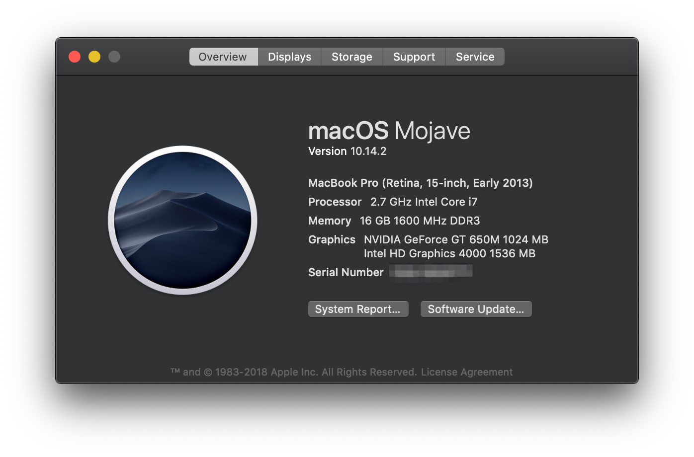

# Macbook tips

Some tips and command for MacOS.



## Command

### [Install Bash git completion](https://github.com/bobthecow/git-flow-completion/wiki/Install-Bash-git-completion)

```
$ brew install git bash-completion
```

Add bash-completion to your `~/.bash_profile` or `.extra`

```
[ -f /usr/local/etc/bash_completion ] && . /usr/local/etc/bash_completion
```

### [How to Change Screenshot Save Location](https://discussions.apple.com/docs/DOC-9081)

1. create new folder in `Desktop`

```
$ mkdir ~/Desktop/screenshots/
```

2. Copy and paste this command to the terminal window:

```
$ defaults write com.apple.screencapture location ~/Desktop/screenshots/
```

### Monospaced font with programming ligatures: [FiraCode](https://github.com/tonsky/FiraCode)

Use [brew](http://brew.sh/) and [cask](https://caskroom.github.io/): Not officially supported, might install outdated version

```
$ brew tap caskroom/fonts
$ brew cask install font-fira-code
```

screenshot: see the `!=` symbol


### Setting the Mac hostname or computer name from the terminal

See the [reference](https://knowledge.autodesk.com/support/smoke/learn-explore/caas/sfdcarticles/sfdcarticles/Setting-the-Mac-hostname-or-computer-name-from-the-terminal.html). change the primary hostname of your Mac:

```
$ scutil --set HostName <new host name>
```

### Main font-bundle for sketch icon-font plugin

* FontAwesome
* Material Design Icons
* Ion Icons
* Simple Line Icons (@bohn002)
* Ant Design Icons

See the [detail](https://github.com/keremciu/font-bundles)


## IDE

- [GraphQL IDE for better development workflows](https://github.com/prisma/graphql-playground)
- [Visual Studio Code](https://code.visualstudio.com)
- [SSH Tunnel Manager](https://www.tynsoe.org/v2/stm/)
- [Elegant Facebook Messenger desktop app](https://github.com/sindresorhus/caprine)
- [Discord App](https://discordapp.com/)
- [Gitter is a chat and networking platform](https://gitter.im/)
- [Docker for Mac](https://docs.docker.com/docker-for-mac/install/)
- [Wechat in China](https://www.wechat.com/en/)
- [Google Chrome](https://www.google.com/chrome/)
- [Telegram Messenger](https://telegram.org/)
- [iTerm2 is a replacement for Terminal and the successor to iTerm](https://www.iterm2.com/downloads.html)
- [Evernote skitch](https://evernote.com/intl/en/products/skitch)
- [MPlayer OSX Extended video player](https://github.com/sttz/MPlayer-OSX-Extended)
- [Universal Database Tool: DBeaver Community](https://dbeaver.io/)
- [Phiewer is the easiest and fastest way to view your images](https://phiewer.com/)
- [FileZilla Client not only supports FTP, but also FTP over TLS (FTPS) and SFTP](https://filezilla-project.org/)

## Tips

### Show all filename extensions in `Finder`

See the following screenshots:


### How to change the ScreenShot Keyboard Shortcut

You can see the [reference](https://www.wikihow.com/Change-the-Keyboard-Shortcut-for-a-Mac-Screenshot).


### Change the Shell in Mac OS X Terminal

You can see the [reference](http://osxdaily.com/2012/03/21/change-shell-mac-os-x/).

open the `terminal` app and select the `preferences`


### Using a Windows PC Keyboard on Mac with Remapped Windows & ALT Keys

See the [reference](http://osxdaily.com/2018/01/31/use-windows-pc-keyboard-mac-remap-option-command-keys/)


1. Select your windows keyboard.
2. Click the dropdown next to `OPTION Key` and select `Command`
3. Click the dropdown next to `COMMAND Key` and select `Option`


### Tmux scrollback in terminal (iTerm2)

You can copy my [.tmux.conf](https://github.com/appleboy/dotfiles/blob/5c6bd88915b6ba97c50ff9f6f7627d9ad1ff31d9/.tmux.conf#L1) config file and [update the profile of iTerm2](https://stackoverflow.com/questions/12865559/leaving-tmux-scrollback-in-terminal-iterm2) as following screenshot:


