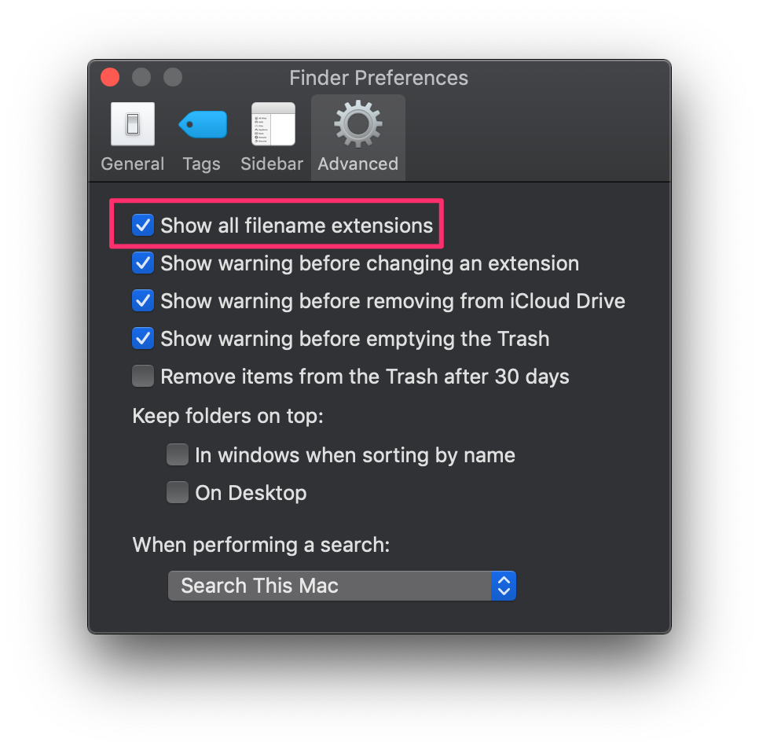
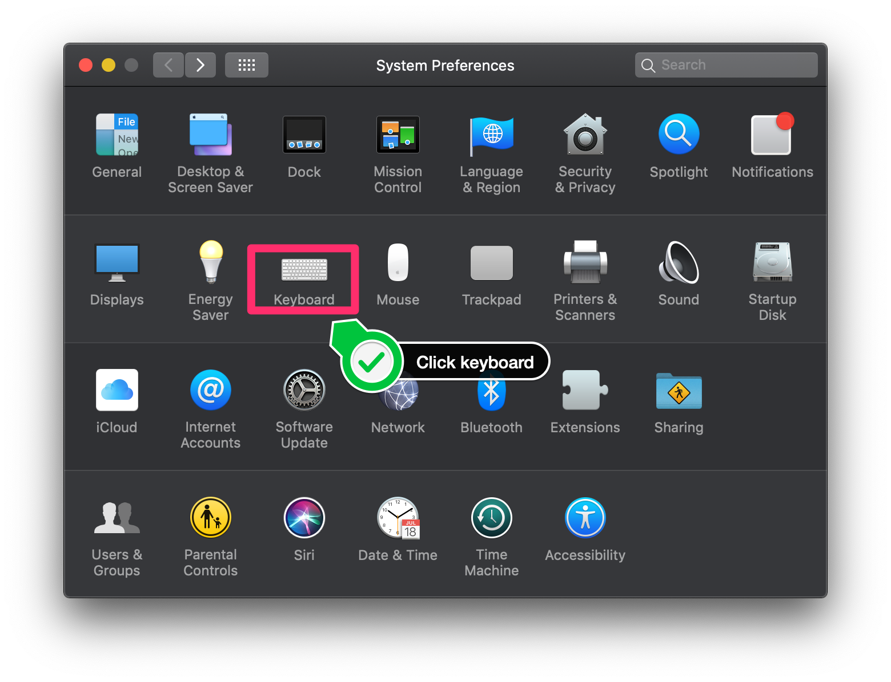
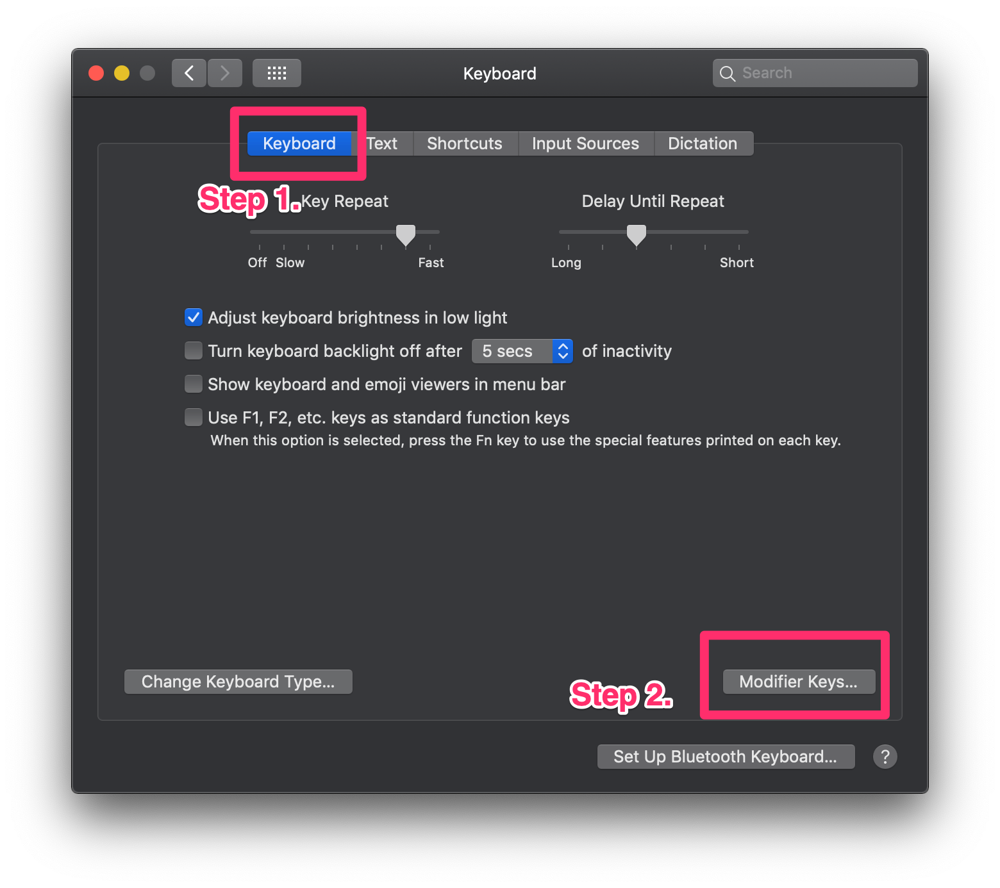
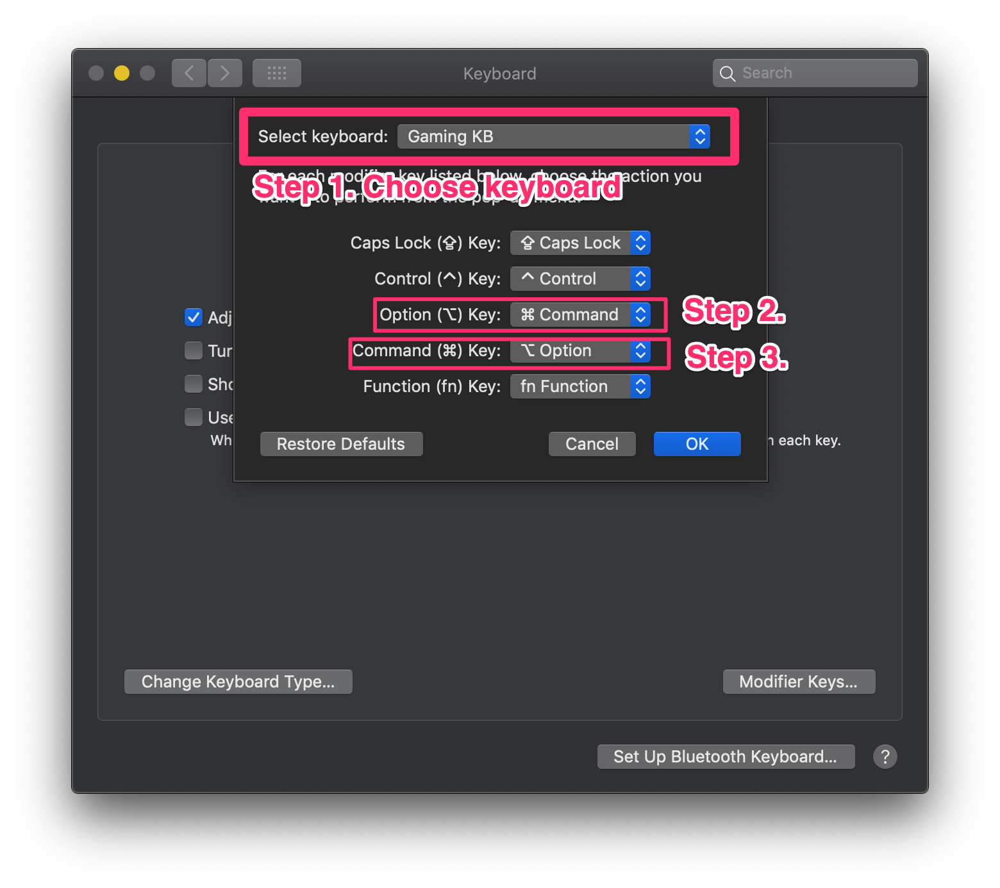

# Macbook 技巧

[**English**](./README.md) | [繁體中文](./README.zh-tw.md) | **简体中文**

## 目录

- [Macbook 技巧](#macbook-技巧)
  - [目录](#目录)
  - [命令集](#命令集)
    - [安装 Homebrew](#安装-homebrew)
    - [安装 Bash Git 补全](#安装-bash-git-补全)
    - [修改截图保存位置](#修改截图保存位置)
    - [编程连字字体： FiraCode](#编程连字字体-firacode)
    - [终端设置 Mac 主机名](#终端设置-mac-主机名)
    - [Sketch Icon 字体包](#sketch-icon-字体包)
    - [安装 jq 命令](#安装-jq-命令)
  - [推荐应用与 IDE](#推荐应用与-ide)
  - [技巧](#技巧)
    - [Finder 显示所有文件扩展名](#finder-显示所有文件扩展名)
    - [修改截图快捷键](#修改截图快捷键)
    - [在 Mac OS X Terminal 更换 Shell](#在-mac-os-x-terminal-更换-shell)
    - [使用 Windows 键盘并重映射 Windows \& ALT 键](#使用-windows-键盘并重映射-windows--alt-键)
    - [更改 iTerm2 默认 Shell](#更改-iterm2-默认-shell)
    - [iTerm2/Tmux 滚动记录设置](#iterm2tmux-滚动记录设置)
    - [VSCode Sierra 原生标签](#vscode-sierra-原生标签)
    - [更改 Windows 键盘按键映射](#更改-windows-键盘按键映射)
    - [iTerm2 热键设置](#iterm2-热键设置)
    - [开启三指拖移](#开启三指拖移)
    - [更改 Spotlight 快捷键](#更改-spotlight-快捷键)
    - [Bash 跳词技巧（iTerm2）](#bash-跳词技巧iterm2)
  - [故障排除](#故障排除)
  - [贡献指南](#贡献指南)

精选 macOS 用户实用命令、技巧和工具集。

本指南适用：

- **高级用户**、开发者：希望提升效率、利用自动化和各种 macOS 技巧。
- **新手**：希望快速上手或提升工作流程的用户。
- 所有寻求系统安装、设置和软件推荐信息的 macOS 用户。

**如何使用本指南：**

1. 利用上方 [目录](#目录) 快速浏览各部分。
2. 每条命令/技巧均有说明，请先阅读再操作。
3. 链接与参考资源帮助深入学习和排查问题。
4. 操作配图辅助理解每一步。

欢迎贡献改进意见或新技巧，让文档更完善！


*Apple MacBook M1 — 兼具轻薄设计和 macOS 性能*

## 命令集

### 安装 Homebrew

详见 [Homebrew 官网](https://brew.sh/)，官方完整安装说明与文档。

**用途：**
Homebrew 是 macOS 必备的软件包管理工具，便于在终端中快速安装应用程序和开发工具。

**安装步骤：**

1. 打开终端（Terminal）。
2. 输入以下命令（需有安装权限）：

```sh
/bin/bash -c "$(curl -fsSL https://raw.githubusercontent.com/Homebrew/install/HEAD/install.sh)"
```

*安装完成后，输入 `brew --version` 验证*

---

### 安装 Bash Git 补全

**用途：**  
启用 Bash 下 Git 命令的自动补全，提高效率。

**安装步骤：**

1. 先确保已安装 Homebrew。
2. 输入以下命令：

```bash
brew install git bash-completion
```

*同时启用 Git 和 Bash 补全功能。*

**进一步设置：**  
在你的 `~/.bash_profile` 或 `.extra` 配置文件中添加如下内容，新开终端自动激活补全：

```bash
[ -f /usr/local/etc/bash_completion ] && . /usr/local/etc/bash_completion
```

### [修改截图保存位置](https://discussions.apple.com/docs/DOC-9081)

在桌面创建新文件夹：

```bash
mkdir ~/Desktop/screenshots/
```

运行此命令，将截图保存到该文件夹：

```bash
defaults write com.apple.screencapture location ~/Desktop/screenshots/
```

### 编程连字字体： [FiraCode](https://github.com/tonsky/FiraCode)

官方 FiraCode 仓库，包含完整安装指南与介绍。

**可用 cask 命令安装（注意可能非最新版）：**

```bash
brew tap homebrew/cask-fonts
brew install font-fira-code --cask
```


*FiraCode 字体 — 程序员友好的连字显示*

### 终端设置 Mac 主机名

进阶用法参考 [Autodesk 主机名设置教程](https://knowledge.autodesk.com/support/smoke/learn-explore/caas/sfdcarticles/sfdcarticles/Setting-the-Mac-hostname-or-computer-name-from-the-terminal.html)。

执行命令：

```bash
scutil --set HostName <新主机名>
```

### Sketch Icon 字体包

- FontAwesome
- Material Design Icons
- Ion Icons
- Simple Line Icons (@bohn002)
- Ant Design Icons

完整列表及用法见 [keremciu/font-bundles GitHub](https://github.com/keremciu/font-bundles)。


*Sketch 插件支持多种图标字体包*

### [安装 jq 命令](https://stedolan.github.io/jq/)

jq 是轻量灵活的命令行 JSON 处理器，可通过 [JQPlay 在线试用](https://jqplay.org/)。


*终端中的 jq 解析 JSON*

## 推荐应用与 IDE

精选常用 macOS 工具以及开发支持应用：

- [GraphQL Playground](https://github.com/prisma/graphql-playground)：GraphQL 交互式 IDE。
- [Visual Studio Code](https://code.visualstudio.com)：流行的跨平台代码编辑器。
- [SSH Tunnel Manager](https://www.tynsoe.org/stm/)：图形化 SSH 隧道管理。
- [Caprine](https://github.com/sindresorhus/caprine)：精致 Facebook Messenger 桌面客户端。
- [Discord](https://discordapp.com/)：社区与开发者语音/文字聊天。
- [Gitter](https://gitter.im/)：开发者交流平台。
- [Docker for Mac](https://docs.docker.com/docker-for-mac/install/)：容器开发平台。
- [WeChat](https://www.wechat.com/en/)：亚太常用即时通讯。
- [Google Chrome](https://www.google.com/chrome/)：稳定的网页浏览器。
- [Telegram 桌面版](https://github.com/telegramdesktop/tdesktop)：安全高效的即时通讯工具。
- [iTerm2](https://www.iterm2.com/downloads.html)：功能强大的终端替代方案。
- [Evernote Skitch](https://evernote.com/intl/en/products/skitch)：截图和标注工具。
- [MPlayer OSX Extended](https://github.com/sttz/MPlayer-OSX-Extended)：全能媒体播放器。
- [DBeaver Community](https://dbeaver.io/)：通用数据库工具。
- [Phiewer](https://phiewer.com/)：快速图片浏览器。
- [FileZilla Client](https://filezilla-project.org/)：支持 FTP/FTPS/SFTP 传输。
- [Slack](https://slack.com/)：团队和项目协作沟通。
- [Postman](https://www.getpostman.com/downloads/)：API 开发与测试工具。
- [TablePlus](https://github.com/TablePlus/TablePlus)：可视化数据库管理工具。
- [Keka](https://www.keka.io)：文件压缩/解压工具。
- [Elmedia Player](https://www.elmedia-video-player.com/)：现代 macOS 媒体播放器。
- [Robo 3T](https://robomongo.org/download)：MongoDB 图形界面客户端。
- [Microsoft Remote Desktop](https://apps.apple.com/tw/app/microsoft-remote-desktop/id1295203466?mt=12)：远程连接 Windows。
- [Diagrams.net](https://www.diagrams.net/)：安全优先团队绘图工具。
- [Mipony](https://www.mipony.net/en/)：下载管理器。
- [IINA](https://iina.io/)：现代 macOS 播放器。
- [Fig](https://fig.io/)：终端补全助手。
- [AppCleaner](https://freemacsoft.net/appcleaner/)：卸载工具。
- [MacWhisper](https://goodsnooze.gumroad.com/l/macwhisper)：AI 音频转录工具。
- [Mounty for NTFS](https://mounty.app/)：启用 NTFS 写入（免费轻量）。

## 技巧

### Finder 显示所有文件扩展名

见以下操作截图：


*Finder 显示所有文件扩展名*

### 修改截图快捷键

参考 [WikiHow 教程](https://www.wikihow.com/Change-the-Keyboard-Shortcut-for-a-Mac-Screenshot)。


*截图快捷键设置界面*


*更多可选截图快捷键*

### 在 Mac OS X Terminal 更换 Shell

详细请参考 [OSXDaily 教程](http://osxdaily.com/2012/03/21/change-shell-mac-os-x/)。

步骤：

1. 打开终端，进入“偏好设置”。


*设置终端新偏好*


*在偏好设置中切换终端 Profile 与 Shell*

### 使用 Windows 键盘并重映射 Windows & ALT 键

参考 [OSXDaily 键盘映射教程](http://osxdaily.com/2018/01/31/use-windows-pc-keyboard-mac-remap-option-command-keys/)。


*在系统设置中将 Windows/Alt 映射 Command/Option*

1. 选择你的 Windows 键盘
2. OPTION 键选择 Command
3. COMMAND 键选择 Option



### 更改 iTerm2 默认 Shell


*chsh 命令将默认 shell 更改为 bash*

```sh
chsh -s /bin/bash
```

详见 [Apple 官方：设置 zsh 为默认 shell](https://support.apple.com/en-us/HT208050)。

### iTerm2/Tmux 滚动记录设置

见 [.tmux.conf 配置文件](https://github.com/appleboy/dotfiles/blob/5c6bd88915b6ba97c50ff9f6f7627d9ad1ff31d9/.tmux.conf#L1) 和 [Stack Overflow 教程](https://stackoverflow.com/questions/12865559/leaving-tmux-scrollback-in-terminal-iterm2)。


*iTerm2 内 Tmux 滚动配置参考*

### VSCode Sierra 原生标签

参考 [讨论](https://github.com/microsoft/vscode/issues/76537#issuecomment-510070135)。


*VSCode 使用 Sierra 风格窗口标签*


*VSCode macOS 原生标签界面*

更多细节：[Apple 官方分页教学](https://support.apple.com/guide/mac-help/use-tabs-in-windows-mchla4695cce/mac)


*系统原生多标签窗口演示*

### 更改 Windows 键盘按键映射

见 [SuperUser 方案](https://superuser.com/questions/158561/how-can-i-remap-windows-and-alt-keys-in-os-x/158568)。


### iTerm2 热键设置

iTerm2 → 偏好设置 → Profiles → Keys → Presets 选择“Natural Text Editing”，见 [QA 指南](https://apple.stackexchange.com/questions/136928/using-alt-cmd-right-left-arrow-in-iterm)。


*iTerm2 设置自然编辑模式热键*

### 开启三指拖移


*三指拖移设置第一步*


*三指拖移设置第二步*

### 更改 Spotlight 快捷键


### Bash 跳词技巧（iTerm2）

在 iTerm2 中，若需使用 `Option + 右箭头` 快速跳至下一个单词，请按以下方法设置：

1. 打开 iTerm2。
2. 顶部菜单选择「iTerm2」→「Preferences」。
3. 在偏好窗口选择「Profiles」。
4. 左侧选择你的 Profile（通常是 Default）。
5. 点击「Keys」子标签。
6. 右下点击「+」新增快捷键设置。
7. 设置如下：
   - 键盘快捷键：Option + 右箭头
   - Action：Send Escape Sequence
   - Esc+：f

此时按 `Option + 右箭头`，iTerm2 将发送 `Esc+f`（bash 中跳至下个单词开头）。

如需左跳，请再设置：

- 快捷键：Option + 左箭头
- Action：Send Escape Sequence
- Esc+：b

设置完成后，iTerm2 支持这两个快捷键快速移动光标。

---

## 故障排除

如遇常见问题可参考：

- **权限错误：** 某些命令需 `sudo` 权限，请检查账户权限。
- **缺少依赖包：** 请确保已安装最新 macOS 和 Xcode 命令行工具 (`xcode-select --install`)。
- **Homebrew 未找到：** 按照 [官网](https://brew.sh/) 重新安装并重启终端。
- **命令未找到：** 检查拼写和包安装情况（如 `brew list`）。
- 其它工具相关问题，请参考对应章节官方文档。

如仍无法解决，可[提交 issue](https://github.com/appleboy/macbook/issues)或联系项目维护者寻求帮助。

---

## 贡献指南

欢迎所有贡献和建议！

- Fork 本仓库并提交 PR。
- 提交 issue 或推荐新技巧。
- 文档需保持简洁、清晰和风格一致。
- 所有贡献者将在发布说明和文档历史中列名。

感谢你让这份文档帮助更多用户！
