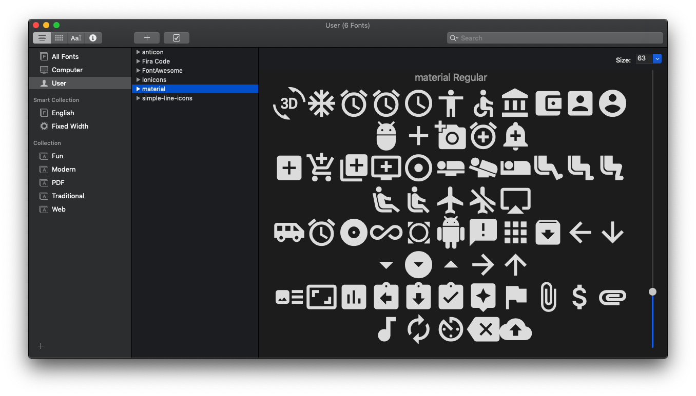
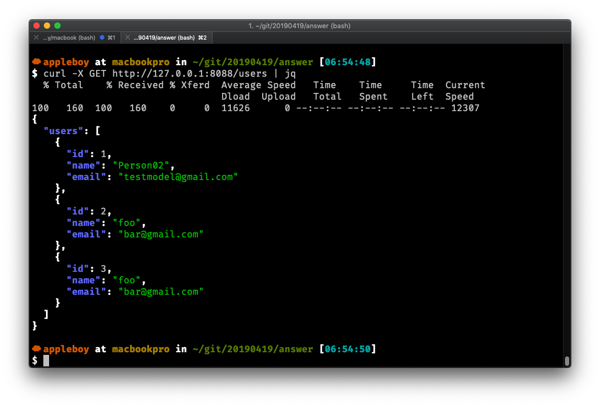
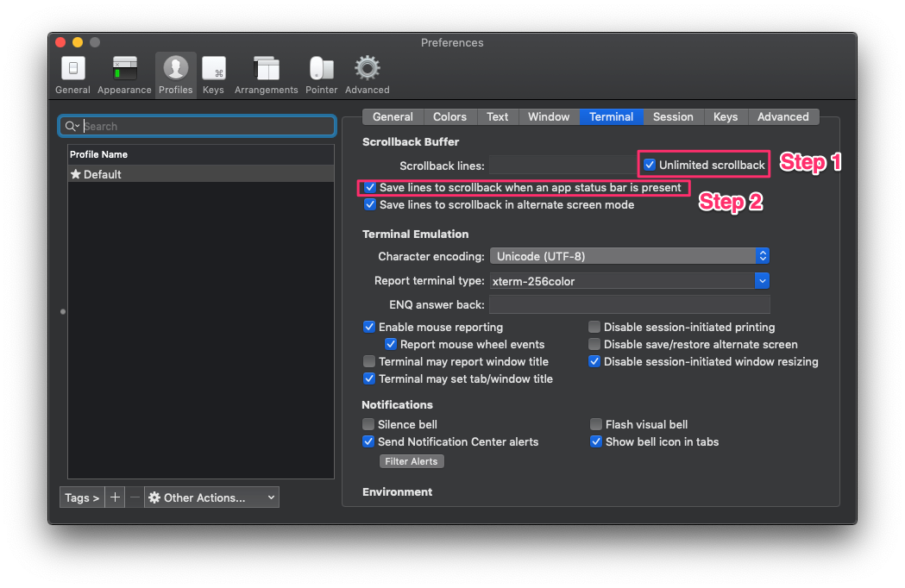
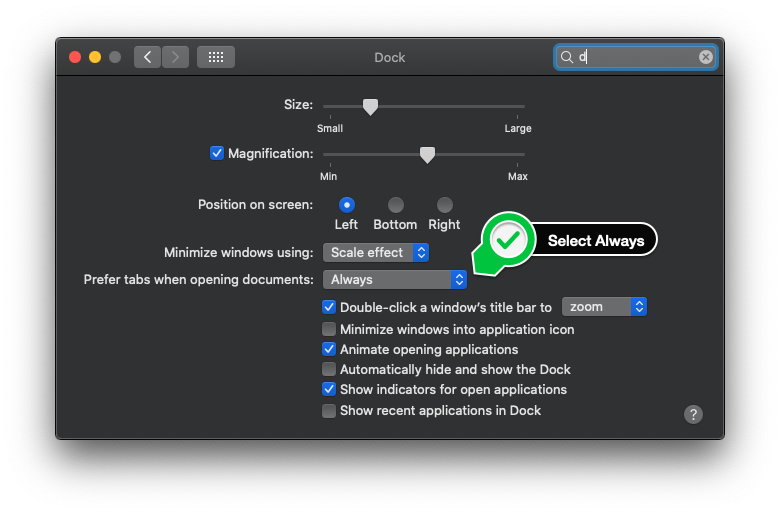
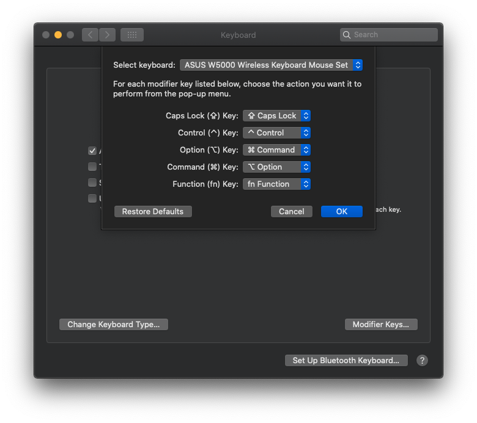

# Macbook 技巧

[**English**](./README.md) | **繁體中文** | [简体中文](./README.zh-cn.md)

## 目錄

- [Macbook 技巧](#macbook-技巧)
  - [目錄](#目錄)
  - [指令集](#指令集)
    - [安裝 Homebrew](#安裝-homebrew)
    - [安裝 Bash Git 自動補全](#安裝-bash-git-自動補全)
    - [變更截圖儲存位置](#變更截圖儲存位置)
    - [程式語言連字型：FiraCode](#程式語言連字型firacode)
    - [用終端機設定 Mac 主機名稱](#用終端機設定-mac-主機名稱)
    - [Sketch Icon 字型套件](#sketch-icon-字型套件)
    - [安裝 jq 指令](#安裝-jq-指令)
  - [推薦應用程式與 IDE](#推薦應用程式與-ide)
  - [小技巧](#小技巧)
    - [在 Finder 顯示所有副檔名](#在-finder-顯示所有副檔名)
    - [變更截圖鍵盤快捷鍵](#變更截圖鍵盤快捷鍵)
    - [在 Mac OS X Terminal 更換 Shell](#在-mac-os-x-terminal-更換-shell)
    - [使用 Windows 鍵盤並重新對應 Windows \& ALT 鍵](#使用-windows-鍵盤並重新對應-windows--alt-鍵)
    - [更換 iTerm2 預設 Shell](#更換-iterm2-預設-shell)
    - [iTerm2/Tmux 捲動記錄設定](#iterm2tmux-捲動記錄設定)
    - [VSCode Sierra Tabs 原生標籤](#vscode-sierra-tabs-原生標籤)
    - [更改 Windows 鍵盤按鍵對應](#更改-windows-鍵盤按鍵對應)
    - [設定 iTerm2 熱鍵](#設定-iterm2-熱鍵)
    - [開啟三指拖移](#開啟三指拖移)
    - [變更 Spotlight 快捷鍵](#變更-spotlight-快捷鍵)
    - [Bash 跳字技巧 (iTerm2)](#bash-跳字技巧-iterm2)
  - [疑難排解](#疑難排解)
  - [貢獻指南](#貢獻指南)

精選 macOS 使用者實用指令、技巧與工具集。

本指南適合：

- **進階用戶**、開發者：希望提升效率、運用自動化與各種 macOS 技巧。
- **新手**：想快速上手或提升工作流程的使用者。
- 所有尋找系統安裝、設定、軟體推薦資訊的 macOS 粉絲。

**如何利用本指南：**

1. 利用上方 [目錄](#目錄) 快速瀏覽各區段。
2. 每組指令/技巧皆附說明，請詳細閱讀再操作。
3. 連結與參考資源可延伸學習與除錯。
4. 圖片示意輔助每步操作。

歡迎貢獻改進意見與新技巧，讓本文件更完善！


*Apple MacBook M1 — 輕盈設計與 macOS 效能兼具*

## 指令集

### 安裝 Homebrew

詳見 [Homebrew 官網](https://brew.sh/)，提供完整安裝說明與文件。

**用途說明：**
Homebrew 是 macOS 必備套件管理員，可從終端機快速安裝應用及開發工具。

**安裝步驟：**

1. 開啟 Terminal。
2. 執行下列指令（需有安裝權限）：

```sh
/bin/bash -c "$(curl -fsSL https://raw.githubusercontent.com/Homebrew/install/HEAD/install.sh)"
```

*完成後可輸入 `brew --version` 驗證是否安裝成功。*

---

### 安裝 Bash Git 自動補全

**用途說明：**
啟用 Git 指令於 Bash 下的自動補全提升操作效率。

**安裝步驟：**

1. 請先安裝好 Homebrew。
2. 執行下列指令：

```bash
brew install git bash-completion
```

*此指令同時安裝 Git 及 bash tab 補全支援。*

**進階設定：**
於 `~/.bash_profile` 或 `.extra` 增加以下設定，每次開新 Terminal 自動啟用：

```bash
[ -f /usr/local/etc/bash_completion ] && . /usr/local/etc/bash_completion
```

### [變更截圖儲存位置](https://discussions.apple.com/docs/DOC-9081)

於桌面建立新資料夾：

```bash
mkdir ~/Desktop/screenshots/
```

執行此指令，將系統截圖自動存入指定資料夾：

```bash
defaults write com.apple.screencapture location ~/Desktop/screenshots/
```

### 程式語言連字型：[FiraCode](https://github.com/tonsky/FiraCode)

官方 FiraCode Repo 含完整安裝指南與特色介紹。

**可用 cask 指令安裝（注意版本可能落後）：**

```bash
brew tap homebrew/cask-fonts
brew install font-fira-code --cask
```


*FiraCode 字型 — 提升程式可讀性的連字功能*

### 用終端機設定 Mac 主機名稱

進階用戶請參考 [Autodesk 主機名稱設定教學](https://knowledge.autodesk.com/support/smoke/learn-explore/caas/sfdcarticles/sfdcarticles/Setting-the-Mac-hostname-or-computer-name-from-the-terminal.html)。

執行：

```bash
scutil --set HostName <新主機名稱>
```

### Sketch Icon 字型套件

- FontAwesome
- Material Design Icons
- Ion Icons
- Simple Line Icons (@bohn002)
- Ant Design Icons

完整列表與用法請見 [keremciu/font-bundles GitHub](https://github.com/keremciu/font-bundles)。


*Sketch plugin 支援多種圖標字型*

### [安裝 jq 指令](https://stedolan.github.io/jq/)

jq 是輕巧靈活的命令列 JSON 處理工具。可至 [JQPlay 線上試用](https://jqplay.org/)。


*終端機中使用 jq 解析 JSON 實例*

## 推薦應用程式與 IDE

以下是精選常用 macOS 工具及開發輔助程式：

- [GraphQL Playground](https://github.com/prisma/graphql-playground)：互動式 GraphQL IDE。
- [Visual Studio Code](https://code.visualstudio.com)：高度擴充的熱門程式編輯器。
- [SSH Tunnel Manager](https://www.tynsoe.org/stm/)：圖形化 SSH 管理。
- [Caprine](https://github.com/sindresorhus/caprine)：優雅 Facebook Messenger 桌面版。
- [Discord](https://discordapp.com/)：社群與開發人員語音/文字聊天。
- [Gitter](https://gitter.im/)：專為開發社群設計的即時通訊平台。
- [Docker for Mac](https://docs.docker.com/docker-for-mac/install/)：容器開發必備平台。
- [WeChat](https://www.wechat.com/en/)：華人圈常用通訊軟體。
- [Google Chrome](https://www.google.com/chrome/)：穩定瀏覽器。
- [Telegram 桌面版](https://github.com/telegramdesktop/tdesktop)：安全高效的即時通訊。
- [iTerm2](https://www.iterm2.com/downloads.html)：進階終端機替代方案。
- [Evernote Skitch](https://evernote.com/intl/en/products/skitch)：螢幕截圖及標註工具。
- [MPlayer OSX Extended](https://github.com/sttz/MPlayer-OSX-Extended)：多功能影音播放器。
- [DBeaver Community](https://dbeaver.io/)：全方位資料庫工具。
- [Phiewer](https://phiewer.com/)：快速圖片瀏覽器。
- [FileZilla Client](https://filezilla-project.org/)：支援 FTP/FTPS/SFTP 傳輸。
- [Slack](https://slack.com/)：專案討論與團隊協作。
- [Postman](https://www.getpostman.com/downloads/)：API 測試工具。
- [TablePlus](https://github.com/TablePlus/TablePlus)：直覺式資料庫管理工具。
- [Keka](https://www.keka.io)：檔案壓縮管理工具。
- [Elmedia Player](https://www.elmedia-video-player.com/)：MacOS 多媒體播放器。
- [Robo 3T](https://robomongo.org/download)：MongoDB 圖形介面管理。
- [Microsoft Remote Desktop](https://apps.apple.com/tw/app/microsoft-remote-desktop/id1295203466?mt=12)：連線遠端 Windows。
- [Diagrams.net](https://www.diagrams.net/)：安全團隊繪圖軟體。
- [Mipony](https://www.mipony.net/en/)：下載管理器。
- [IINA](https://iina.io/)：現代 macOS 播放器。
- [Fig](https://fig.io/)：終端機自動補全輔助工具。
- [AppCleaner](https://freemacsoft.net/appcleaner/)：應用完整移除工具。
- [MacWhisper](https://goodsnooze.gumroad.com/l/macwhisper)：AI 文字轉錄工具。
- [Mounty for NTFS](https://mounty.app/)：開啟 NTFS 寫入（免費輕巧）。

## 小技巧

### 在 Finder 顯示所有副檔名

見下圖操作說明：


*Finder 啟用所有檔案副檔名顯示*

### 變更截圖鍵盤快捷鍵

參考 [WikiHow 教學](https://www.wikihow.com/Change-the-Keyboard-Shortcut-for-a-Mac-Screenshot)。


*macOS 畫面截圖熱鍵設定*


*更多可用截圖快捷鍵設定*

### 在 Mac OS X Terminal 更換 Shell

進一步細節請參考 [OSXDaily macOS Shell 更換教學](http://osxdaily.com/2012/03/21/change-shell-mac-os-x/)。

步驟：

1. 開啟 Terminal，進入「偏好設定」。


*終端機套用新偏好設定*


*偏好設定中切換終端機 Profile 與 Shell 選單*

### 使用 Windows 鍵盤並重新對應 Windows & ALT 鍵

參考 [OSXDaily 鍵盤重新定義教學](http://osxdaily.com/2018/01/31/use-windows-pc-keyboard-mac-remap-option-command-keys/)。


*系統設定：將 Windows/Alt 對應至 Command/Option*

1. 選擇所需 Windows 鍵盤
2. OPTION Key 改為 Command
3. COMMAND Key 改為 Option


### 更換 iTerm2 預設 Shell


*chsh 命令將預設 shell 變更為 bash*

```sh
chsh -s /bin/bash
```

詳見 [Apple 官方：設定 zsh 為預設 shell](https://support.apple.com/en-us/HT208050)。

### iTerm2/Tmux 捲動記錄設定

可參考我的 [.tmux.conf 設定檔](https://github.com/appleboy/dotfiles/blob/5c6bd88915b6ba97c50ff9f6f7627d9ad1ff31d9/.tmux.conf#L1) 及 [Stack Overflow 教學](https://stackoverflow.com/questions/12865559/leaving-tmux-scrollback-in-terminal-iterm2)。


*iTerm2 內 Tmux 捲動記錄設定範例*

### VSCode Sierra Tabs 原生標籤

可參考 [此討論](https://github.com/microsoft/vscode/issues/76537#issuecomment-510070135)。


*VSCode 使用 Sierra 樣式視窗標籤介面*


*VSCode macOS 原生標籤功能展示*

更多細節：[Apple 官方使用分頁功能教學](https://support.apple.com/guide/mac-help/use-tabs-in-windows-mchla4695cce/mac)


*系統原生多分頁視窗示意*

### 更改 Windows 鍵盤按鍵對應

參考 [SuperUser 解法](https://superuser.com/questions/158561/how-can-i-remap-windows-and-alt-keys-in-os-x/158568)。



### 設定 iTerm2 熱鍵

iTerm2 → 偏好設定 → Profiles → Keys → Presets 選「Natural Text Editing」，參考 [問答](https://apple.stackexchange.com/questions/136928/using-alt-cmd-right-left-arrow-in-iterm)。


*iTerm2 設定自然編輯模式熱鍵*

### 開啟三指拖移


*三指拖移設定步驟一*


*三指拖移設定步驟二*

### 變更 Spotlight 快捷鍵


### Bash 跳字技巧 (iTerm2)

在 iTerm2 中，若你希望用 `Option + 右箭頭` 快速跳至下一字，可依下列步驟設定：

1. 開啟 iTerm2。
2. 上方選單選擇「iTerm2」→「Preferences」。
3. 選「Profiles」分頁→ 選擇目前 Profile（通常是 Default）。
4. 點選「Keys」子分頁。
5. 右下按「+」新增快捷鍵設定。
6. 設定：
   - 鍵盤捷徑：按 Option + 右箭頭
   - Action：選 Send Escape Sequence
   - Esc+: 輸入 f

如此當你按 `Option + 右箭頭` 時，iTerm2 會送出 `Esc+f`（bash 可跳至下個單字開頭）。

同理，若要往左跳單字，再新增一組：

- 快捷鍵：Option + 左箭頭
- Action：Send Escape Sequence
- Esc+: b

設定完成後即可於 iTerm2 使用這兩組鍵快速移動游標。

---

## 疑難排解

遇到下列常見問題時可參考：

- **權限錯誤：** 部分指令需要 `sudo`，請檢查帳號權限。
- **缺少相依套件：** 確認 macOS 與 Xcode Command Line Tools 已安裝 (`xcode-select --install`)。
- **找不到 Homebrew：** 重新依 [官網](https://brew.sh/) 安裝並重啟終端機。
- **找不到指令：** 檢查輸入拼字與套件安裝狀態（如 `brew list`）。
- 其餘專屬工具出錯，請參考各段落官方文件說明。

如仍無法排除，建議[回報問題](https://github.com/appleboy/macbook/issues)或聯絡專案維護者。

---

## 貢獻指南

歡迎任何形式的貢獻及建議！

- Fork 本 repo 並提交 PR。
- 回報 open issue 或推薦新技巧。
- 文件撰寫請保持簡潔、清楚、風格一致。
- 貢獻者將會被記錄於發佈說明與歷史紀錄中。

感謝您協助讓這份文件服務更多人！
